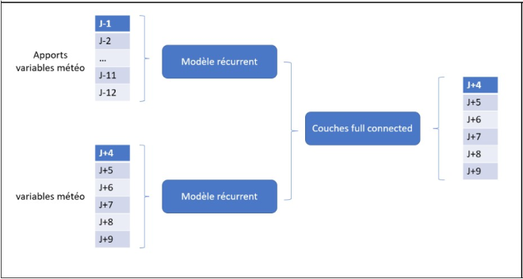
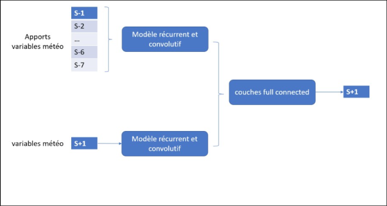
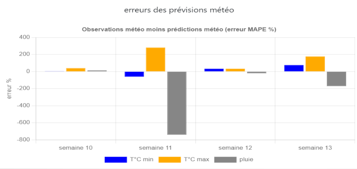

# harvest forecast for cauliflower 

The forecasts are made on Thursday for a forecast from the following Monday to Saturday.

We have past warehouse inputs through Wednesday (eve of prediction), no seeding data. The 10-day weather forecasts are collected via the meteo-concept API.

Non-linear correlations are at most 65% between weather and warehouse inputs.

Two models are created, one agg on week, one agg on day.

daily model:

weekly model :

The predictions error used here is the MAPE (mean absolute error in percentage). It is approximately 10% with the weekly model; large production peaks over two or three weeks (one per year) at an MAPE of 20-30%, due to the absence of data on sowing.

Weather forecasts compared to reality are analyzed by MPE (not absolute MAPE) :

  

Simplified queries are available in req_psql_* files.

